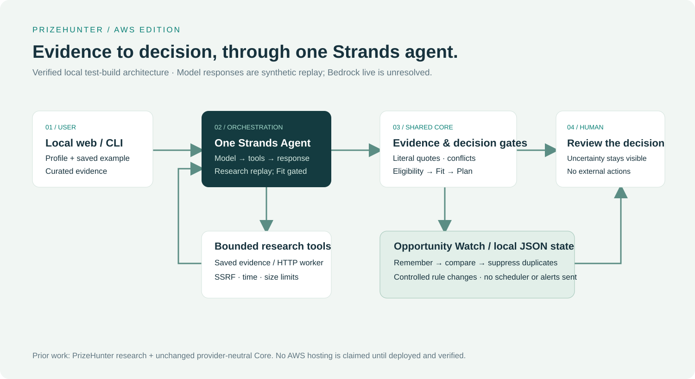

# PrizeHunter AWS Edition

**Turn competition rules into an evidence-grounded decision and a plan you can review.**

Finding an opportunity is easy. Knowing whether you qualify—and whether it deserves your time—is harder. PrizeHunter connects source evidence, eligibility, Fit and an Action Plan, then remembers the opportunity so you do not review the same unchanged information repeatedly.

> **Current evidence level: OFFLINE VERIFIED.** A real Strands agent runs the tool loop with explicitly scripted model responses. Real Bedrock inference and AWS hosting remain unresolved: temporary browser login and STS succeeded, but AWS rejected the first inference request because the new account is still being verified. This is a functioning, reproducible local test build; it is not a live Bedrock demo. AWS STS identity and the Bedrock model catalog were verified; model inference was denied. No cloud-hosted application exists.



[Five demo screenshots](docs/SCREENSHOTS.md) · [Testing evidence](docs/VERIFICATION.md) · [Live validation status](docs/LIVE_VALIDATION.md) · [Prior work](docs/PRIOR_WORK.md)

## What it does

- Accepts a progressively disclosed profile mapped to the existing Core contracts; unknown facts stay unknown.
- Reads a supplied competition source through bounded retrieval, or uses an explicitly labeled saved evidence bundle.
- Requires literal source excerpts and preserves provenance, retrieval failures, rejected claims and uncertainty.
- Applies the existing provider-neutral Core to Eligibility → Fit → Recommendation → Action Plan.
- Stops downstream Fit and Planner inference when a confirmed eligibility blocker exists.
- Persists one goal's Opportunity Watch state and suppresses duplicate decisions.
- Demonstrates a controlled deadline change and preserves the last successful baseline on retrieval failure.

Plans require human review. Nothing registers, submits, pays or sends notifications on your behalf.

## Why Strands is part of the workflow

`StrandsRuntime` creates **one `strands.Agent`**, registers `read_evidence` and `search_opportunities`, and invokes schema-constrained outputs through the SDK's real model/tool loop. Model drafts are untrusted inputs: Core owns the decision gates. Search currently reports unavailable rather than inventing results.

The offline `ReplayModel` emits scripted tool-use events; Strands must actually execute the requested tool before the next response. This verifies orchestration and guards, **not model intelligence or Bedrock access**. A separate explicitly gated `BedrockModel` adapter and bounded validation script are implemented but remain unverified live. Strands is pinned to `1.55.1`.

## What is new in the AWS Edition

New work includes the Strands runtime and structured-output boundary, the Bedrock adapter, bounded HTTP/PDF retrieval, Opportunity Watch, the local browser test build and AWS-specific integration tests. The competition research, provider-neutral Core, schemas and compatibility fixtures are disclosed prior work, not work created from zero for this edition.

## Workflow and architecture

Goal + approved source → one Strands agent → source evidence → literal validation → Core Eligibility / Fit / Action Plan → local Watch state → human review.

The browser exposes only curated test-build routes. It cannot trigger a paid model call. The diagram shows the currently verified local implementation; no cloud host, AgentCore or other unused AWS service is represented as deployed. See [architecture](docs/ARCHITECTURE.md).

## Install

Use Python 3.12 and [uv](https://docs.astral.sh/uv/). No AWS credentials are required for the test build.

```sh
git clone https://github.com/hansonxdxd/prizehunter-aws.git
cd prizehunter-aws
uv sync --frozen --python 3.12
uv run --no-sync python scripts/verify_manifest.py
```

The pinned Core is included under `packages/core`. Installation does not access either private reference project. The original Core README describes its source repository; its historical documentation links do not imply a runtime dependency on those files.

## Run locally

```sh
uv run --no-sync python -m prizehunter_aws.web --port 8080
```

Open **http://127.0.0.1:8080/**. Click **Run saved synthetic example**. Expect `uncertain`, `verify first`, a verification action and four scripted model calls through Strands. **Try synthetic hard blocker** uses a synthetic Taiwan profile against a fictitious Canada-only rule; it returns an ineligible decision and skips Fit/Planner inference (two model calls). Neither profile represents the author's identity.

For your own inputs, use **Check my profile against demo rules**. Essentials include residence, citizenship, legal adulthood, participant statuses, skills, technical capabilities, hours, interests and goals. Expand participation preferences for team, travel and reusable work; uncommon rule facts are under **Advanced Eligibility**. The validated profile and preferences actually reach Core eligibility and Fit inputs. Arbitrary personalized Fit/Plan are **unavailable offline**: only the saved example has scripted recommendations. Your custom profile is not persisted. See the [field mapping and limitations](docs/PROFILE.md).

The CLI exposes the saved demonstration slice:

```sh
uv run --no-sync prizehunter demo
uv run --no-sync prizehunter demo --country Taiwan
uv run --no-sync prizehunter analyze --mode replay --goal examples/synthetic-goal.json --evidence examples/synthetic-evidence.json --drafts examples/synthetic-drafts.json
```

## Opportunity Watch

In the browser, run the five numbered buttons in order:

| Step | New pending decisions | Meaning |
| --- | ---: | --- |
| First observation / reset | 1 | Save the dedicated demo baseline |
| Identical rerun | 0 | Suppress duplicate decision |
| Simulate deadline change | 1 | **CONTROLLED TEST**, not an organizer update |
| Repeat changed state | 0 | Suppress duplicate change |
| Simulate retrieval failure | 0 | Preserve last successful baseline |

Watch always uses its separate saved synthetic example, independently of your edited profile. The baseline is currently synthetic because real Bedrock validation is unresolved. State lives in `local-state/web/judge-watch.json`; `PH_WEB_STATE_DIR` can select another local state directory. The reset button resets only this dedicated demo state. This is a sequential, single-goal test build; it is not a scheduler, notification service, shared-user database or global discovery system.

## Tests and package build

```sh
uv run --no-sync pytest -ra
uv run --no-sync ruff check src scripts tests/test_slice.py tests/test_web.py tests/test_profile_form.py
uv build
uv build packages/core
```

Latest offline suite: **90 passed, 1 skipped**. The skip is a paid Bedrock live test. See [verification](docs/VERIFICATION.md) for exact release commands and results.

## AWS prerequisites and live validation

The actual attempted model is Amazon Nova Lite via `us.amazon.nova-lite-v1:0` in `us-east-1`. Its catalog entry is active and streaming-capable. The first Strands `ConverseStream` request was denied with **account verification pending**; successful model inference has **not** been established. Follow [live validation](docs/LIVE_VALIDATION.md) after securely configuring AWS login and granting the needed account permissions.

Do not retry while account verification is pending. Once its status changes, the bounded harness defaults to **in-region `amazon.nova-lite-v1:0` in `us-east-1`**. Geographic `us.amazon.nova-lite-v1:0` requires separate verified support; the previous failed attempt is historical evidence, not the next default. No additional Bedrock request was made during the Profile restoration.

Environment variable examples contain placeholders only:

```sh
export AWS_PROFILE=YOUR_APPROVED_PROFILE
export AWS_REGION=YOUR_APPROVED_REGION
export PH_ALLOW_PAID_BEDROCK=1
export PH_BEDROCK_MODEL_ID=YOUR_APPROVED_MODEL_ID
export PH_AWS_ACCOUNT_ID=YOUR_APPROVED_ACCOUNT_ID
```

Never commit credentials, account-specific configuration, `.env`, private live traces or unreviewed source pages. The bounded operator script uses STS to verify the configured identity, then analyzes the known [Agents for Humans rules](https://agentsforhumans.devpost.com/rules). Do not enable the paid test suite merely to run the offline demo.

## Security, cost boundaries and limitations

Public URL retrieval requires approved origins, public DNS targets and pinned IP connections; each redirect is checked. It enforces robots policy, bounded retries, source size and time, and returns explicit failures for thin dynamic pages and unsupported PDFs. It does not bypass access controls, use credentials/cookies or execute page instructions.

The operator live harness allows three attempts, eight model calls per attempt, bounded execution time and fixed output limits. It records token-based cost estimates, not billing guarantees. The browser has no paid route, arbitrary URL fetch or shell execution. This sprint made **one denied Bedrock inference request**, received **zero usage tokens**, estimated **$0 model cost**, and deployed **zero AWS resources**. This estimate is not a billing report. These figures concern this project's work, not the account's overall bill.

The local server is for a curated test build. It has no production identity, scheduler, email, LINE notifications, broad search or multi-tenant state. Evidence quotes validate textual support; they do not prove the model interpreted a rule correctly. Uncertainty and human review remain part of the result.

## Prior Work Disclosure

PrizeHunter AWS Edition builds on prior PrizeHunter product research, a Google-based prototype and an existing provider-neutral PrizeHunter Core. The reused Core, research, schemas and fixtures are prior work where applicable. The AWS Edition adds the Strands implementation, AWS integration adapter, Opportunity Watch and this edition's browser/submission work. It is **not clean-room or entirely new-from-zero code**.

The 21 reused files are byte-pinned in `SOURCE_MANIFEST.json` to source commit `f269f7f3af4cf61f79771d63bcf3af0acf356955`. The Google submission and PrizeHunter_NEXT remain private and unchanged. A fresh public Git lineage excludes private working history; it does not erase provenance or imply organizer approval. See [the detailed disclosure](docs/PRIOR_WORK.md).

## License

Author-owned code in this distribution, including the authorized Core export, is licensed under [MIT](LICENSE). Third-party dependencies retain their own licenses and notices: [THIRD_PARTY_NOTICES.md](THIRD_PARTY_NOTICES.md) and [inventory](docs/THIRD_PARTY_INVENTORY.json). This grant does not relicense the original private repositories or third-party material.
