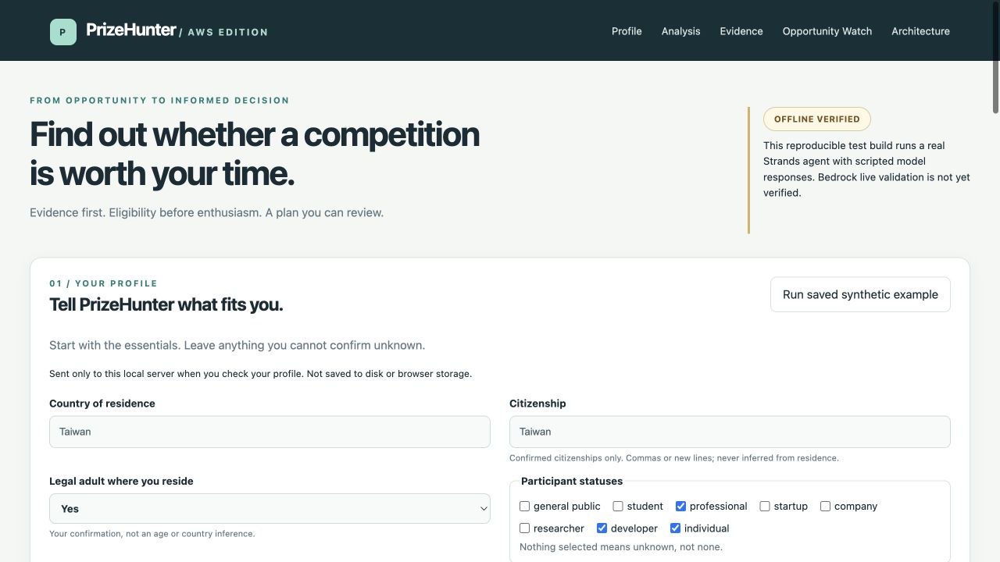
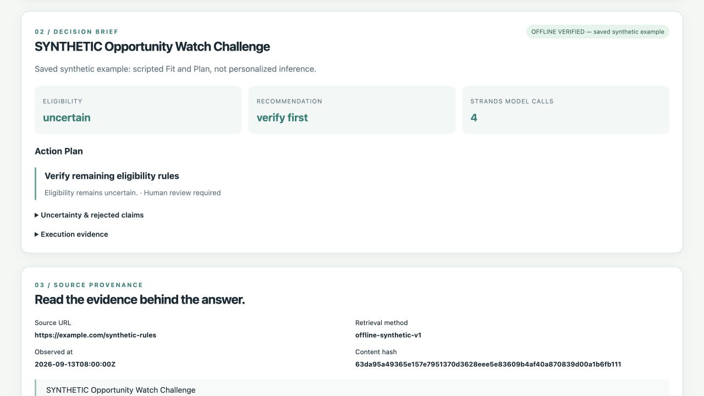
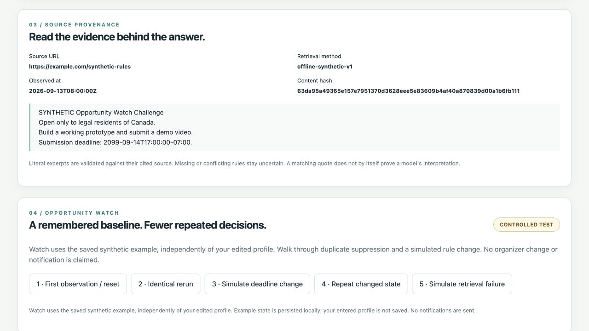
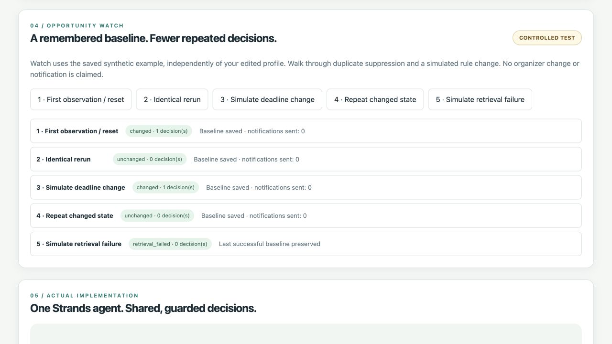
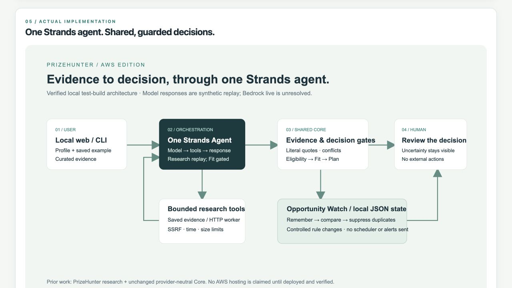

# Final screenshot index

Exactly five recommended submission screenshots, captured from the current real browser UI. These are neither mockups nor successful Bedrock results. Use these files, not older images embedded in unrelated handoffs. All five use the current implementation; the Profile frame uses the fictional Taiwan builder and the Decision frame intentionally switches to the labeled saved Canadian example.

| Filename | What it proves | Evidence level | Devpost caption (≤140 characters) |
| --- | --- | --- | --- |
| [screenshots/01_input.png](screenshots/01_input.png) | AWS identity and editable fictional Taiwan profile; not verified author identity. | OFFLINE VERIFIED / CONTROLLED TEST | PrizeHunter AWS Edition: editable profile facts, with unknowns preserved. Fictional Taiwan builder. |
| [screenshots/02_offline_analysis.png](screenshots/02_offline_analysis.png) | Saved synthetic Canadian decision: uncertain, verify first, four scripted calls and verification plan. | OFFLINE VERIFIED / CONTROLLED TEST | Saved synthetic example: uncertain eligibility, verify-first recommendation and a human-reviewed plan. |
| [screenshots/03_evidence.png](screenshots/03_evidence.png) | Synthetic source URL, method, timestamp, hash and literal excerpt visible. | CONTROLLED TEST | Synthetic evidence with source, observed time, hash and literal excerpt. No live Bedrock result is claimed. |
| [screenshots/04_watch.png](screenshots/04_watch.png) | Actual controlled Watch sequence 1/0/1/0/0 with failure preserving last good baseline. | OFFLINE VERIFIED / CONTROLLED TEST | Controlled Watch sequence: 1, 0, 1, 0, 0. Failed retrieval preserves the baseline; no notifications sent. |
| [screenshots/05_architecture.png](screenshots/05_architecture.png) | Current local runtime, one Strands agent, Core, bounded tools, local Watch and human review. | OFFLINE VERIFIED | Actual local architecture: one Strands agent, validated evidence, shared Core, local Watch and human review. |

Capture order: prepared Taiwan Profile at page top → saved synthetic example / Analysis → Evidence → five Watch steps / Watch → Architecture. Keep labels/source identifiers readable; never crop away a mode label to imply live behavior.

If Bedrock later succeeds, replace **02** with a verified real or saved-live result and **03** with that result's real-source provenance. Replace **04** only after testing the real baseline; controlled changes must remain labeled. Replace **05** only if actual runtime/hosting changes, and **01** if the analyzed profile changes. Continue to recommend exactly five files. A Bedrock success does not by itself justify an AWS-hosted caption.

